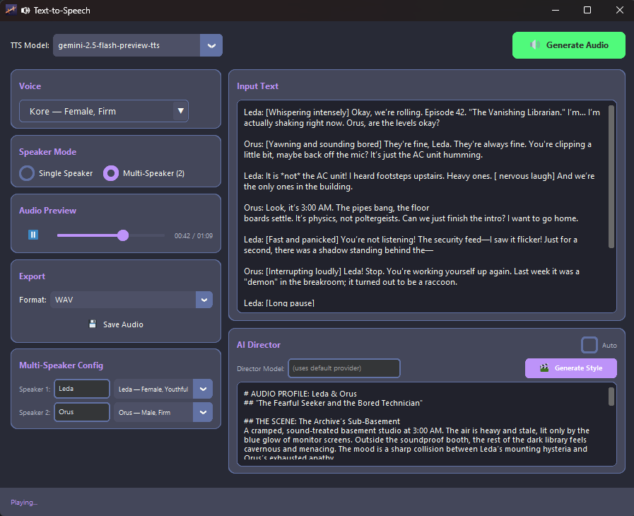
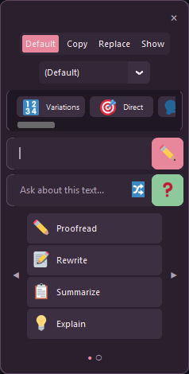
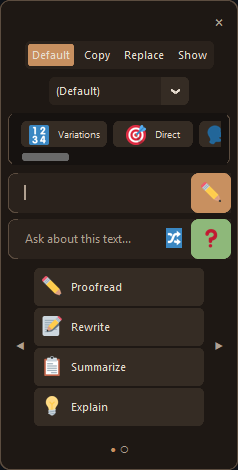
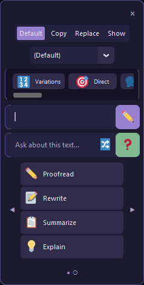
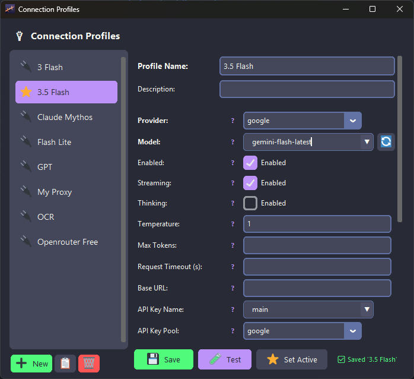

# AIPromptBridge

**AIPromptBridge** is a Windows system-wide app that brings AI assistance to your fingertips. Use global hotkeys to edit text using AI, capture and analyze audio or screen content, and chat with models, all from a lightweight system tray app.

<details>
  <summary>🎬 Click to expand video demo</summary>
  
https://github.com/user-attachments/assets/3f3620fd-eae5-4b4d-80d9-2f7826da61b8

</details>

## ✨ Features

### 🎯 TextEditTool


Press **Ctrl+Space** anywhere to invoke AI on selected text:

- **Understand** - **Explain**, **Generate Summaries**, or **Keypoints**
- **Edit** - **Proofread** (✏️), **Rewrite** (📝), or make it **Casual** (😎)
- **Q&A** - Use the second input box in the popup to ask any question about the text
- **Compare** - Use the 🔀 Compare button to compare selected text with another text selection
- **Custom prompts** - Define and group your own actions in the Prompt Editor

Works in any application: browsers, IDEs, Notepad, Word, everywhere.

<br clear="right"/>

### 📸 Screen Snip (SnipTool)


Press **Ctrl+Alt+X** to capture a region of your screen and analyze it with AI:

- **OCR** - **Extract Text** or **OCR to Markdown** for clean formatting
- **Analysis** - **Describe**, **Summarize**, or **Explain Code**
- **Data** - **Extract Data** to tables, **Transcribe** handwriting, or **Smart Cleanup** notes
- **Compare** - **Compare Images** to analyze differences between two screenshots
- **Response Modes** - Choose to show result in Chat Window, Copy to Clipboard, or Type directly into active field

<br clear="right"/>

### 🎤 Audio Analyzer


Press **Ctrl+Alt+A** to record and analyze audio:

- **Record** - Capture microphone input or system audio (loopback)
- **Transcribe** - High-fidelity transcription with timestamps and speaker identification
- **Analyze** - Summarize meetings, extract key points, or analyze tone
- **Controls** - Visual level meter, compression settings (Opus/MP3), and preview
- **Integration** - Send audio directly to chat context for follow-up questions

### 🔊 Text-to-Speech (TTS)



Convert text into expressive speech using Gemini TTS models:

- **30 Voices** - Choose from 30 prebuilt voices with distinct styles (Bright, Firm, Upbeat, etc.)
- **AI Director** - Automatically generates style instructions for expressive, nuanced speech
- **Two Models** - Flash (fast) and Pro (quality) TTS model options
- **Multi-Speaker** - Support for up to 2 speakers with individual voice assignment
- **Playback** - Built-in audio preview with play/pause and seek controls
- **Export** - Save generated audio as WAV files
- **Entry Points** - 🔊 button in popups, `[T]` terminal key, hotkey `Ctrl+Alt+T`, and system tray menu

### 💬 Chat Interface


Lightweight chat windows with:

- Streaming responses (real-time typing)
- Markdown rendering
- Session history (browse and restore)
- Multi-theme UI with 9 color schemes

### 🎨 Theme System

The app supports 9 distinct themes with both Dark and Light variants:

| Catppuccin                                                      | Dracula                                                      | Nord                                                      |
| --------------------------------------------------------------- | ------------------------------------------------------------ | --------------------------------------------------------- |
|  |  |  |

| Gruvbox                                                      | Minimal                                                      | High Contrast                                                     |
| ------------------------------------------------------------ | ------------------------------------------------------------ | ----------------------------------------------------------------- |
|  |  |  |

| Rose                                                      | Coffee                                                      | Violet                                                      |
| --------------------------------------------------------- | ----------------------------------------------------------- | ----------------------------------------------------------- |
|  |  |  |

Customizable appearance with:

- **9 themes**: Catppuccin, Dracula, Nord, Gruvbox, Minimal, High Contrast, Rose, Coffee, Violet
- **Dark/Light modes**: Each theme has both variants
- **System detection**: Auto-switches based on Windows theme
- **Live preview**: See theme changes instantly in Settings

### 🔄 Robust Backend

- **Multi-provider support** - Google Gemini, Anthropic Claude, OpenAI, OpenRouter, xAI (Grok), Mistral, Cohere, and Custom OpenAI-compatible endpoints
- **Connection Profiles** - Dedicated connection profiles (`profiles.json`) for provider, model, thinking, streaming, and advanced params — assignable per-action or globally
- **Automatic key rotation** - Switch API keys on rate limits (429, 401, 403)
- **Smart retry logic** - Handles errors gracefully with configurable delays
- **Empty response detection** - Automatically retries with next key
- **Streaming support** - Real-time responses
- **Batch Processing** - Async processing for large workloads (Gemini Batch API)
- **Attachment Manager** - Efficient external storage for session images, audio, and files
- **Self-Update** - Check for updates and install directly from the app (via tray menu, terminal `U` key, or on startup)

### 🧰 Tools System (Not accessible in No Console mode)

The **File Processor** tool enables bulk operations:

- **Batch Processing**: Process folders of Images, Audio, Code, Text, or PDFs
- **Audio Optimization**: Reduce file size (mono, sample rate) for efficient AI processing
- **Configurable**: On-demand `tools_config.json` creation
- **Smart Handling**:
  - **Large Files**: Auto-switches to Gemini Files API or Chunking logic
  - **Checkpoints**: Resume interrupted jobs or retry failures
  - **Interactive Mode**: Pause (`P`), Stop (`S`), or Abort (`Esc`) during processing

The **TTS Processor** tool enables batch text-to-speech generation:

- **Text Splitting**: Lines, paragraphs, sentences, or whole file modes
- **Voice Selection**: 30 prebuilt Gemini voices with single or multi-speaker support
- **Style Instructions**: Manual, default, no style, or AI Director (single/per-segment)
- **AI Director**: Auto-generates expressive style instructions for nuanced speech
- **Output Modes**: Individual WAV files per segment or merged into single file
- **Checkpoints**: Full resume support with failure retry
- **Interactive Mode**: Pause (`P`), Stop (`S`) during generation

## 🚀 Quick Start

### Download (Recommended)

1. Download `AIPromptBridge.zip` from [GitHub Releases](https://github.com/zaxx-q/AIPromptBridge/releases)
2. Extract and run `AIPromptBridge.exe` (use `AIPromptBridge-NoConsole.exe` to hide console)
3. On first launch, a setup wizard will automatically run to guide you step-by-step to quickly get started
4. If you skip setup wizard or need to make changes later:
   - Access **Profiles** to edit and test your connection profiles.
   - Access **Settings** to customize theme modes, general behavior, and tool configurations.
5. The app runs minimized to the Windows system tray. Double-click tray icon to hide/unhide the console.

### From Source (Alternative)

```bash
git clone https://github.com/zaxx-q/AIPromptBridge.git
cd AIPromptBridge
pip install -r requirements.txt
python main.py
```

## 📋 Usage

### System Tray


Right-click the tray icon for:

- **Toggle Console or Double click tray icon** - Toggle console visibility (Not visible in No Console mode)
- **Session Browser** - View chat history
- **Direct Chat** - Open text input popup (Ctrl+Space)
- **Screen Snip** - Trigger screen capture (Ctrl+Alt+X)
- **Audio Analyzer** - Open audio tool (Ctrl+Alt+A)
- **TTS** - Open Text-to-Speech window (Ctrl+Alt+T)
- **Settings** - Open GUI settings editor
- **Prompt Editor** - Customize prompts sent to AI, preview prompts in Playground
- **Profiles** - Open Connection Profile Manager
- **Edit config.ini** - Open configuration file (only visible with `--show-console` arg)
- **Edit prompts.json** - Open prompts file (only visible with `--show-console` arg)
- **Check for Updates** - Check GitHub for new releases and install
- **Restart** - Restart the application
- **Quit** - Exit completely

### TextEditTool

1. Select text in any application
2. Press **Ctrl+Space**
3. Choose an action (Proofread, Rewrite, etc.)
4. Text is replaced or opened in chat

**Without selection**: Opens a quick input bar for direct questions.

### SnipTool (Screen Snipping)

1. Press **Ctrl+Alt+X**
2. Click and drag to select a screen region
3. Choose an action (Describe, Extract Text, etc.) or ask a question
4. Results open in a chat window with the image attached, can also be copied to clipboard or typed directly into the active field.

### Audio Tool

1. Press **Ctrl+Alt+A** to open the Audio Analyzer
2. Select input device (Microphone or System Audio)
3. Click **Record** to capture audio
4. Choose an action (Transcribe, Analyze, etc.)
5. Results are streamed to a chat window or displayed in the result panel

### Console Commands

When console is visible, press these keys:

| Key | Action                                                   |
| --- | -------------------------------------------------------- |
| `S` | Open session browser (Sessions)                          |
| `A` | Open Audio Analyzer                                      |
| `T` | Open TTSTool window (Text-to-Speech)                     |
| `X` | Open Tools menu                                          |
| `L` | List recent saved sessions                               |
| `I` | Show system info (Status)                                |
| `P` | Switch connection profile                                |
| `K` | Toggle thinking mode (session-scoped)                    |
| `M` | List available models (Use `?N` for details, e.g., `?1`) |
| `R` | Toggle streaming mode (session-scoped)                   |
| `G` | Open Settings window                                     |
| `W` | Open prompt editor                                       |
| `U` | Check for updates                                        |
| `H` | Show help                                                |

## ⚙️ Configuration

AIPromptBridge features a comprehensive GUI for all configuration needs, making it easy to manage settings without touching configuration files.

### 🎛️ Settings Window


Access via **System Tray > Settings**. This window manages the core application configuration (`config.ini`):

- **API Keys**: Manage named API keys and custom key pools for rotation.
- **Connection**: Set your active global profile, assign key pools, and adjust global request timeout / retry parameters.
- **Tools**: Configure hotkeys and behavior for TextEditTool, SnipTool, and AudioTool.
- **Theme**: Switch between 9 themes and toggle Dark/Light modes.
- **System**: Configure server host/port, startup options, and auto-update checks.

### ✏️ Prompt Editor


Access via **System Tray > Prompt Editor**. This window lets you customize how the AI responds (`prompts.json`):

- **Actions**: Create, edit, and organize actions for Text, Snip, and Audio tools.
- **Connection Profiles**: Assign per-action connection profiles (provider, model, thinking, streaming, temperature, etc.).
- **Modifiers**: Customize the modifier bar buttons (e.g., "Shorter", "Professional").
- **Playground**: Test your prompts in real-time with text, images, or audio before saving.
- **Hot-Reload**: Changes apply immediately without restarting the app.

### 🔌 Connection Profile Manager



Access via **System Tray > Profiles**, terminal `C` key, or **Settings > Provider > Manage Profiles**. Manages connection profiles (`profiles.json`):

- **Profiles**: Create, edit, duplicate, and delete connection profiles.
- **Per-Profile Settings**: Provider, model, streaming, thinking, temperature, max tokens, and timeout configuration.
- **Active Profile**: Set any profile as the global default — all tools and actions use it unless overridden.
- **Per-Action Override**: Assign a specific profile to individual actions in the Prompt Editor.
- **Model Refresh**: Fetch available models from the provider directly in the editor.
- **Test**: Verify a profile's connection with a quick API test.

### 📂 Manual Configuration

For advanced users, configuration files are stored in the application root:

- `config.ini`: Core app settings (connection settings are in profiles, API keys in keys.json).
- `prompts.json`: AI system prompts and tool configurations.
- `profiles.json`: Connection profiles (provider, model, and parameter profiles).

## 💡 Tips

### For Faster Responses

- Use non-reasoning models (e.g., `gemini-3.1-flash-lite-preview` instead of `gemini-3.1-pro-preview`)
- Disable thinking parameter: Press `T` in console or set `thinking_enabled = false`
- Keep streaming enabled for perceived faster responses

### For Better Results

- Enable thinking mode for complex tasks
- Edit the actions/prompts to your needs in Prompt Editor
- Add (more) context when selecting text or asking questions.
- Set the right temperature for the task (e.g., low temperature for OCR tasks, high temp for more creativity)

### For Better GUI Performance

I decided to avoid Qt to minimize app size and bloat so you may sometimes experince lag when resizing AIPromptBridge windows. Underlying Tkinter/CustomTkinter is already a low-performant library, there's nothing I can do about that (see [CustomTkinter Issue #1461](https://github.com/TomSchimansky/CustomTkinter/issues/1461)).
but if you want to improve performance:

- Enable **Force Standard Tkinter** (`ui_force_standard_tk`) under the **Theme** tab in Settings. This sacrifices the modern looks and colored emojis for snappier UI.

### Getting API Keys

- **Google Gemini (Recommended)**: Get a free API key from [Google AI Studio](https://aistudio.google.com/app/apikey)
- **Anthropic Claude**: Get an API key from [Anthropic Console](https://platform.claude.com/settings/workspaces/default/keys)
- **OpenRouter**: Get an API key from [OpenRouter](https://openrouter.ai/keys)
- **OpenAI**: Get an API key from [OpenAI Platform](https://platform.openai.com/api-keys)
- **xAI (Grok)**: Get an API key from [xAI Console](https://console.x.ai/)
- **Mistral**: Get an API key from [Mistral Console](https://console.mistral.ai/)
- **Cohere**: Get an API key from [Cohere Dashboard](https://dashboard.cohere.com/)

### API Key Management

- Add multiple API keys in pools for each provider for automatic rotation
- If one key hits rate limits, the next one is used automatically
- The system tracks exhausted keys and skips them
- Keys rotate on: 429 (rate limit), 401/402/403 (auth errors), empty responses
- **Export & Import**: Export plaintext JSON backups and import/merge keys directly via the API Keys settings tab (handles duplicate detection automatically).
- **Security**: You can also provide keys via Environment Variables (auto-migrated to `keys.json` on first run if it doesn't exist):
  - `GEMINI_API_KEY`
  - `ANTHROPIC_API_KEY`
  - `OPENAI_API_KEY`
  - `OPENROUTER_API_KEY`
  - `XAI_API_KEY`
  - `MISTRAL_API_KEY`
  - `COHERE_API_KEY`
  - `CUSTOM_API_KEY`

## 🔧 Command Line Options

```bash
AIPromptBridge.exe --show-console     # Doesn't automatically hide console at startup, also enable debug logs
AIPromptBridge.exe --no-wt            # Skip Windows Terminal detection and redirection (handled by launcher)
```

> 💡 **Console View**: For the best console experience (including full color emoji support), it is highly recommended to use [Windows Terminal](https://apps.microsoft.com/store/detail/windows-terminal/9N0DX20HK701). AIPromptBridge will attempt to automatically relaunch in Windows Terminal if detected.

## 📖 Documentation

- [Project Structure](docs/PROJECT_STRUCTURE.md) - File organization
- [Architecture](docs/ARCHITECTURE.md) - Technical details

## 📝 Requirements

- **Windows 10/11** (uses Windows-specific APIs for tray, console, snipping, and audio capture mechanims)
- **Windows Terminal** (Highly recommended for better console view and colors)
- **Python 3.13+** (if running from source)
- **FFmpeg** (Required for audio compression and conversion features)
  - [Download FFmpeg](https://ffmpeg.org/download.html)
  - [Install Guide](https://www.wikihow.com/Install-FFmpeg-on-Windows) - Ensure it is added to your system PATH
- API keys for at least one provider (Google Gemini recommended)

## 📄 License

[MIT License](LICENSE)

### Attribution & Third-Party Licenses

This project uses [Twemoji](https://github.com/jdecked/twemoji) graphics, licensed under [CC-BY 4.0](https://creativecommons.org/licenses/by/4.0/).
