# AIPromptBridge

<p align="center">
  <strong>• AI Desktop Tools & Integration Bridge •</strong>
</p>

**AIPromptBridge** is a Windows desktop application that brings AI assistance to your fingertips. Use global hotkeys to edit text using AI, capture and analyze audio or screen content, and chat with models, all from a lightweight system tray app.

## ✨ Features

### 🎯 TextEditTool
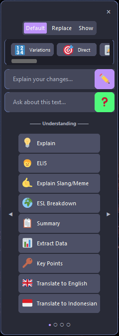

Press **Ctrl+Space** anywhere to invoke AI on selected text:
- **Understand** - **Explain**, **Generate Summaries**, or **Keypoints**
- **Edit** - **Proofread** (✏️), **Rewrite** (📝), or make it **Casual** (😎)
- **Q&A** - Use the second input box in the popup to ask any question about the text
- **Custom prompts** - Define and group your own actions in the Prompt Editor

Works in any application: browsers, IDEs, Notepad, Word, everywhere.

<br clear="right"/>

### 📸 Screen Snip (SnipTool)
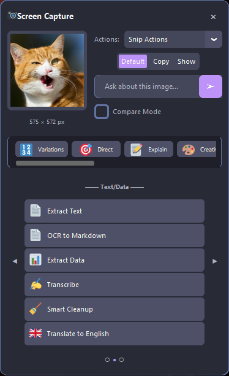

Press **Ctrl+Shift+X** to capture a region of your screen and analyze it with AI:
- **OCR** - **Extract Text** or **OCR to Markdown** for clean formatting
- **Analysis** - **Describe**, **Summarize**, or **Explain Code**
- **Data** - **Extract Data** to tables, **Transcribe** handwriting, or **Smart Cleanup** notes
- **Compare** - **Compare Images** to analyze differences between two screenshots
- **Response Modes** - Choose to show result in Chat Window, Result Panel, or Copy to Clipboard

<br clear="right"/>

### 🎤 Audio Analyzer
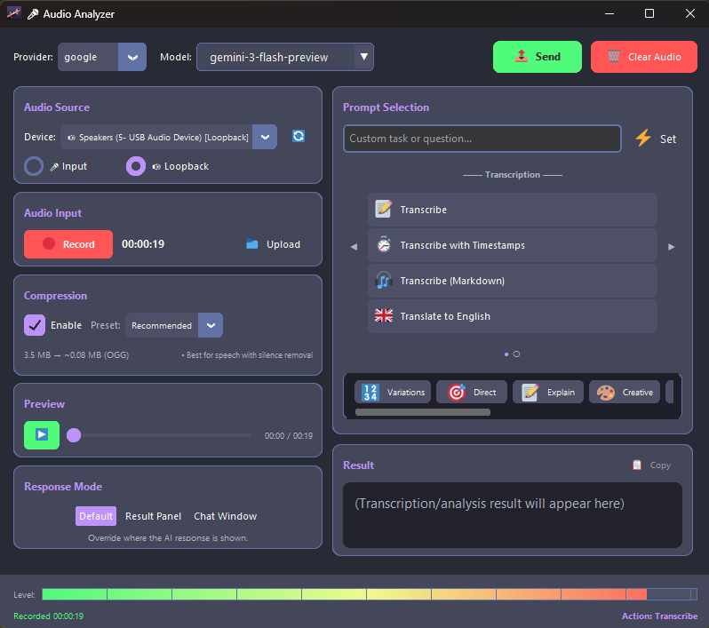

Press **Ctrl+Shift+A** to record and analyze audio:
- **Record** - Capture microphone input or system audio (loopback)
- **Transcribe** - High-fidelity transcription with timestamps and speaker identification
- **Analyze** - Summarize meetings, extract key points, or analyze tone
- **Controls** - Visual level meter, compression settings (Opus/MP3), and preview
- **Integration** - Send audio directly to chat context for follow-up questions

### 💬 Chat Interface
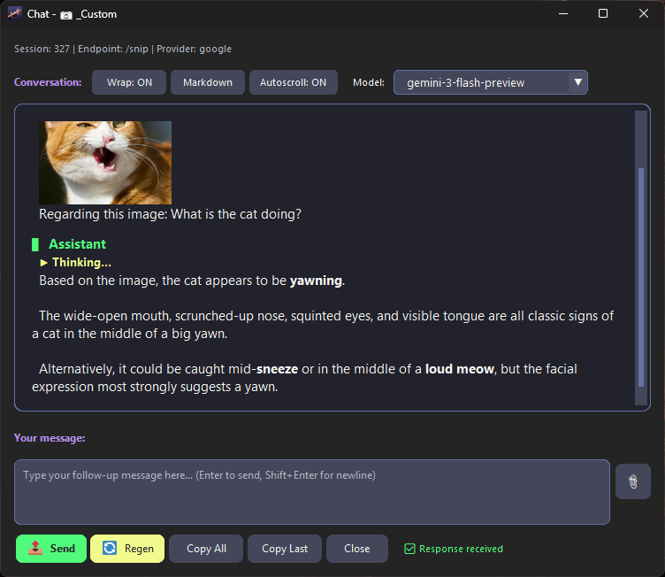

Lightweight chat windows with:
- Streaming responses (real-time typing)
- Markdown rendering
- Session history (browse and restore)
- Multi-theme UI with 7 color schemes

### 🎨 Theme System

The app supports 7 distinct themes with both Dark and Light variants:

| Catppuccin | Dracula | Nord |
|------------|---------|------|
| 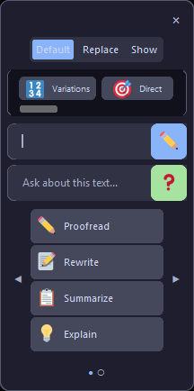 | 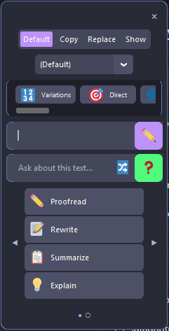 | 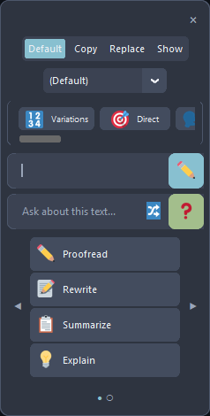 |

| Gruvbox | OneDark | Minimal |
|---------|---------|---------|
| 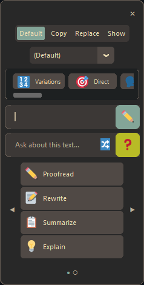 | 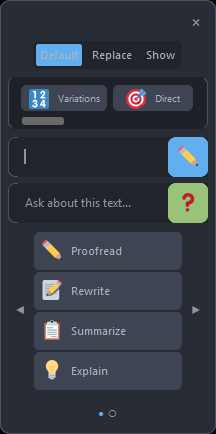 | 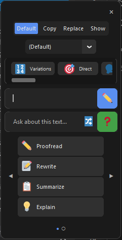 |

| High Contrast | | |
|---------------|---|---|
| 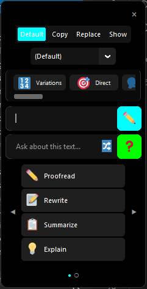 | | |

Customizable appearance with:
- **7 themes**: Catppuccin, Dracula, Nord, Gruvbox, OneDark, Minimal, High Contrast
- **Dark/Light modes**: Each theme has both variants
- **System detection**: Auto-switches based on Windows theme
- **Live preview**: See theme changes instantly in Settings

### 🔄 Robust Backend
- **Multi-provider support** - Google Gemini, OpenRouter, custom endpoints
- **Automatic key rotation** - Switch API keys on rate limits (429, 401, 403)
- **Smart retry logic** - Handles errors gracefully with configurable delays
- **Empty response detection** - Automatically retries with next key
- **Streaming support** - Real-time responses
- **Batch Processing** - Async processing for large workloads (Gemini Batch API)
- **Attachment Manager** - Efficient external storage for session images, audio, and files

### 🧰 Tools System (Not accessible in No Console mode)
The **File Processor** tool enables bulk operations:
- **Batch Processing**: Process folders of Images, Audio, Code, Text, or PDFs
- **Audio Optimization**: Reduce file size (mono, sample rate) for efficient AI processing
- **Configurable**: On-demand `tools_config.json` creation
- **Smart Handling**:
  - **Large Files**: Auto-switches to Gemini Files API or Chunking logic
  - **Checkpoints**: Resume interrupted jobs or retry failures
  - **Interactive Mode**: Pause (`P`), Stop (`S`), or Abort (`Esc`) during processing

## 🚀 Quick Start

### Download (Recommended)

1. Download `AIPromptBridge.zip` from [GitHub Releases](https://github.com/zaxx-q/AIPromptBridge/releases)
2. Extract and run `AIPromptBridge.exe` (use `AIPromptBridge-NoConsole.exe` to hide console)
3. On first launch, it automatically opens the Settings window in **API Keys** tab. Enter API keys, enter key name (Optional), and click **Add**
4. Optionally configure selected provider, endpoint URL or models in **Provider** tab and click **Save**
5. The app starts minimized to system tray

### From Source (Alternative)

```bash
git clone https://github.com/zaxx-q/AIPromptBridge.git
cd AIPromptBridge
pip install -r requirements.txt
python main.py
```

## 📋 Usage

### System Tray

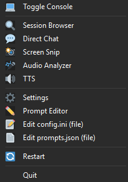

Right-click the tray icon for:
- **Toggle Console or Double click tray icon** - Toggle console visibility (Not visible in No Console mode)
- **Session Browser** - View chat history
- **Direct Chat** - Open text input popup (Ctrl+Space)
- **Screen Snip** - Trigger screen capture (Ctrl+Shift+X)
- **Audio Analyzer** - Open audio tool (Ctrl+Shift+A)
- **Settings** - Open GUI settings editor
- **Prompt Editor** - Edit TextEditTool prompts
- **Edit config.ini** - Open configuration file (only visible with `--show-console` arg)
- **Edit prompts.json** - Open prompts file (only visible with `--show-console` arg)
- **Restart** - Restart the application
- **Quit** - Exit completely

### TextEditTool

1. Select text in any application
2. Press **Ctrl+Space**
3. Choose an action (Proofread, Rewrite, etc.)
4. Text is replaced or opened in chat

**Without selection**: Opens a quick input bar for direct questions.

### SnipTool (Screen Snipping)

1. Press **Ctrl+Shift+X**
2. Click and drag to select a screen region
3. Choose an action (Describe, Extract Text, etc.) or ask a question
4. Results open in a chat window with the image attached, can also directly copied to clipboard.

### Audio Tool

1. Press **Ctrl+Shift+A** to open the Audio Analyzer
2. Select input device (Microphone or System Audio)
3. Click **Record** to capture audio
4. Choose an action (Transcribe, Analyze, etc.)
5. Results are streamed to a chat window or displayed in the result panel

### API Endpoints

**Note: These endpoints are largely deprecated.**
- **ShareX Users**: ShareX 19.0.1+ now has a native "Analyze image" feature.
- **Desktop Users**: The built-in SnipTool (**Ctrl+Shift+X**) offers better integration.

Endpoints allow HTTP POST access (disabled by default). See [ShareX Setup Guide](docs/SHAREX_SETUP.md) if needed.

### Console Commands

When console is visible, press these keys:

| Key | Action |
|-----|--------|
| `S` | Show system status |
| `O` | Open session browser |
| `M` | List available models (Use `?N` for details, e.g., `?1`) |
| `P` | Switch AI provider |
| `T` | Toggle thinking mode |
| `R` | Toggle streaming mode |
| `H` | Show help |

## ⚙️ Configuration

AIPromptBridge features a comprehensive GUI for all configuration needs, making it easy to manage settings without touching configuration files.

### 🎛️ Settings Window
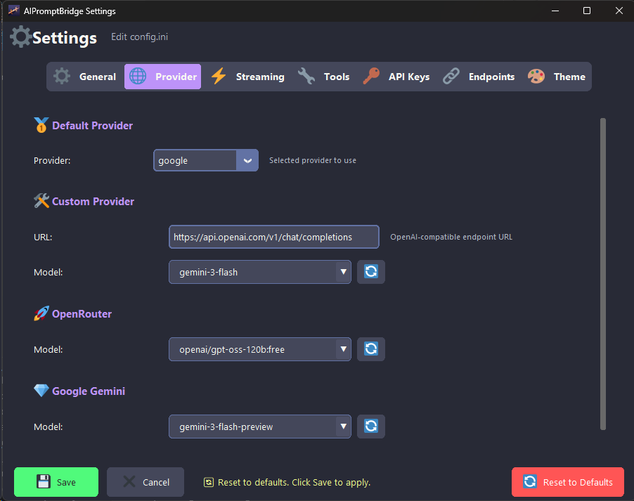

Access via **System Tray > Settings**. This window manages the core application configuration (`config.ini`):
- **API Keys**: Manage keys for Google Gemini, OpenRouter, and Custom providers.
- **Providers**: Select default models and configure endpoint URLs.
- **Tools**: Configure hotkeys and behavior for TextEditTool, SnipTool, and AudioTool.
- **Theme**: Switch between 7 themes and toggle Dark/Light modes.
- **System**: Configure server host/port and startup options.

### ✏️ Prompt Editor
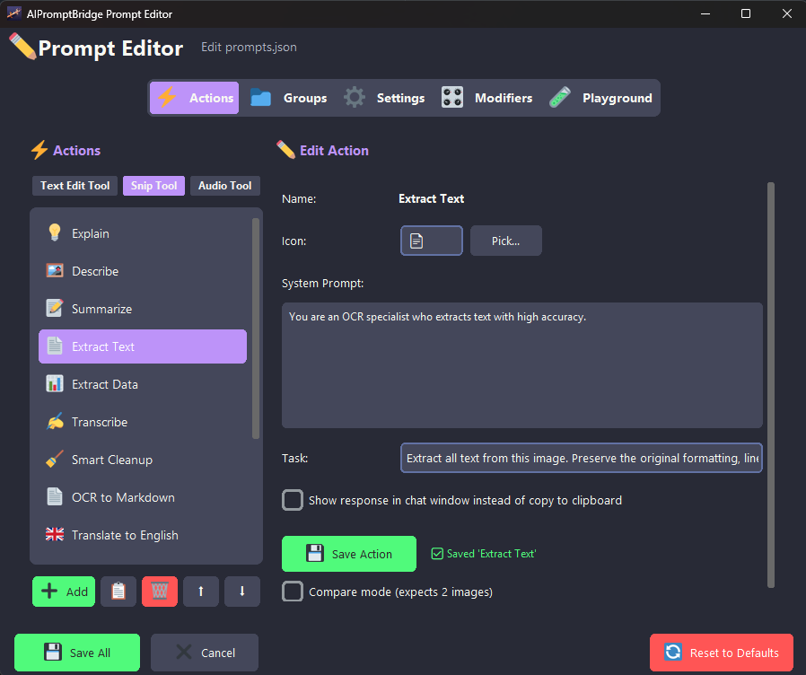

Access via **System Tray > Prompt Editor**. This window lets you customize how the AI responds (`prompts.json`):
- **Actions**: Create, edit, and organize actions for Text, Snip, and Audio tools.
- **Modifiers**: Customize the modifier bar buttons (e.g., "Shorter", "Professional").
- **Playground**: Test your prompts in real-time with text, images, or audio before saving.
- **Hot-Reload**: Changes apply immediately without restarting the app.

### 📂 Manual Configuration
For advanced users, configuration files are stored in the application root:
- `config.ini`: Core settings and API keys.
- `prompts.json`: AI system prompts and tool configurations.

## 💡 Tips

### For Faster Responses
- Use non-reasoning models (e.g., `gemini-2.0-flash` instead of `gemini-2.5-pro`)
- Disable thinking mode: Press `T` in console or set `thinking_enabled = false`
- Keep streaming enabled for perceived faster responses

### For Better Results
- Enable thinking mode for complex tasks
- Use specific prompts in TextEditTool
- Add context when asking questions

### API Key Management
- Add multiple API keys (one per line) for automatic rotation
- If one key hits rate limits, the next one is used automatically
- The system tracks exhausted keys and skips them
- Keys rotate on: 429 (rate limit), 401/402/403 (auth errors), empty responses
- **Security**: You can also provide keys via Environment Variables instead of `config.ini`:
  - `GEMINI_API_KEY`
  - `OPENROUTER_API_KEY`
  - `CUSTOM_API_KEY`

## 🔧 Command Line Options

```bash
AIPromptBridge.exe --no-tray          # No tray icon
AIPromptBridge.exe --show-console     # Doesn't automatically hide console at startup, also enable debug logs
AIPromptBridge.exe --no-wt            # Skip Windows Terminal detection and redirection (handled by launcher)
```

> 💡 **Console View**: For the best console experience (including full color emoji support), it is highly recommended to use [Windows Terminal](https://apps.microsoft.com/store/detail/windows-terminal/9N0DX20HK701). AIPromptBridge will attempt to automatically relaunch in Windows Terminal if detected.

## 📖 Documentation

- [Project Structure](docs/PROJECT_STRUCTURE.md) - File organization
- [Architecture](docs/ARCHITECTURE.md) - Technical details
- [ShareX Setup](docs/SHAREX_SETUP.md) - Screenshot integration

## 📝 Requirements

- **Windows 10/11** (uses Windows-specific APIs for tray, console, snipping, and audio capture mechanims)
- **Windows Terminal** (Highly recommended for better console view and colors)
- **Python 3.13+** (if running from source)
- API keys for at least one provider (Google Gemini recommended)

## 📄 License

[MIT License](LICENSE)

### Attribution & Third-Party Licenses

This project uses [Twemoji](https://github.com/jdecked/twemoji) graphics, licensed under [CC-BY 4.0](https://creativecommons.org/licenses/by/4.0/).
