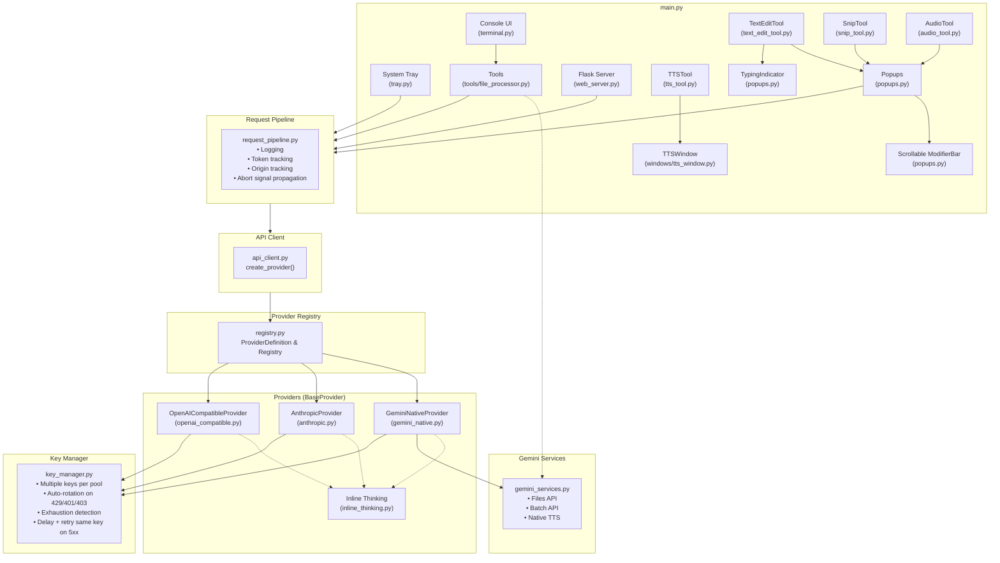
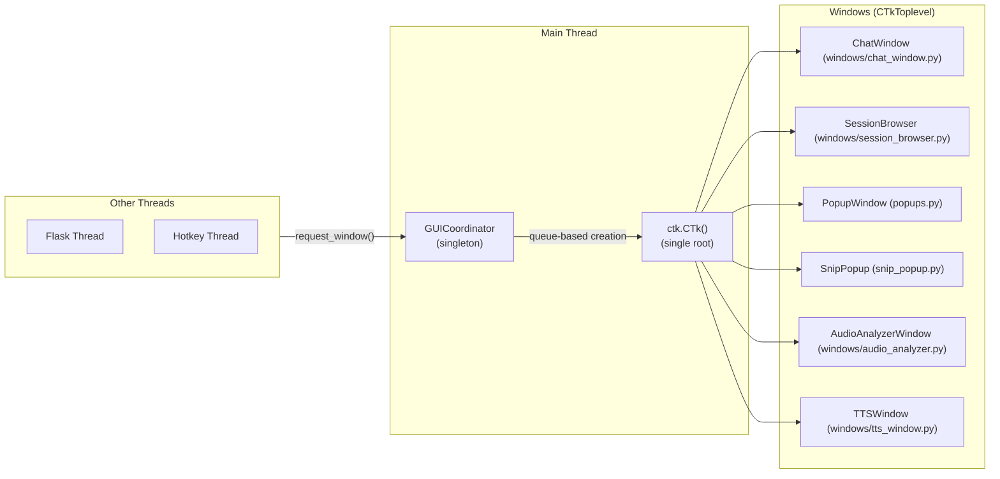
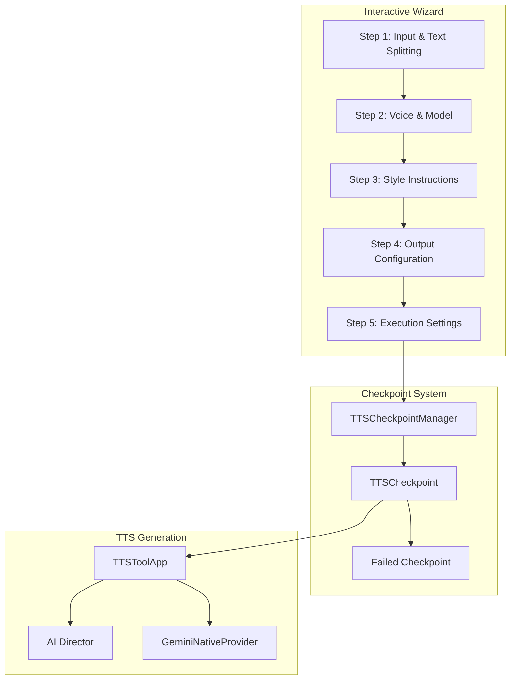

# Architecture

This document describes the technical architecture of AIPromptBridge.

## Overview

AIPromptBridge is a Windows application consisting of:

1. **Flask Web Server** - Internal REST API for session/model management
2. **System Tray Application** - Background process management with `infi.systray`
3. **CustomTkinter GUI** - Modern chat windows, session browser, and popups with multi-theme support
4. **Rich Console Interface** - Modernized terminal UI with structured logging and panels
5. **TextEditTool** - Global hotkey assistance with two-tier "Edit" and "General" prompt architecture
6. **AI Provider System** - Unified abstraction for multiple AI backends
7. **Theme System** - Multi-theme support with dark/light modes and system detection
8. **Settings Infrastructure** - GUI editors for config.ini and prompt options with hot-reload
9. **Tools Subsystem** - Batch file processing framework with checkpoints and audio optimization
10. **TTS (Text-to-Speech)** - Gemini-powered speech synthesis with AI Director for expressive style control
11. **Self-Update System** - Two-phase update from GitHub Releases with rollback protection

## Component Diagram



## Provider System

All AI API calls flow through the unified provider system in `src/providers/`. The architecture is registry-driven, features centralized retry loops and key rotation, supports abort events, and provides a unified base URL configuration.

### Provider Interface

The abstract class `BaseProvider` (`src/providers/base.py`) owns the orchestration, key rotation, timing, and exception handling for all generation calls. Subclasses are simplified and only implement request compilation and response stream chunk extraction.

```python
class BaseProvider:
    # Central Orchestrators (owned by BaseProvider, DO NOT override):
    def generate(self, messages, model, params, thinking_enabled=False, abort_event=None) -> ProviderResult
    def generate_stream(self, messages, model, params, callback, thinking_enabled=False, abort_event=None) -> ProviderResult

    # Subclass implementations:
    @abstractmethod
    def _do_generate(self, messages, model, params, thinking_enabled, api_key, abort_event) -> ProviderResult
    @abstractmethod
    def _do_generate_stream(self, messages, model, params, callback, thinking_enabled, api_key, abort_event) -> ProviderResult
    @abstractmethod
    def fetch_models(self) -> Tuple[Optional[List[Dict]], Optional[str]]
```

### Provider Registry & Definition

The `ProviderDefinition` dataclass (`src/providers/registry.py`) defines metadata for each provider, mapping provider type IDs to specific provider classes, authentication styles, default base URLs, and KeyStore key pools.

| Provider ID | Display Name | Default Base URL | Auth Style | Provider Class | Key Pool |
|---|---|---|---|---|---|
| `google` | Google Gemini | `https://generativelanguage.googleapis.com/v1beta` | `x-goog-api-key` header | `GeminiNativeProvider` | `google` |
| `anthropic` | Anthropic Claude | `https://api.anthropic.com/v1` | `x-api-key` header | `AnthropicProvider` | `anthropic` |
| `openai` | OpenAI | `https://api.openai.com/v1` | `Bearer` token | `OpenAICompatibleProvider` | `openai` |
| `openrouter` | OpenRouter | `https://openrouter.ai/api/v1` | `Bearer` token | `OpenAICompatibleProvider` | `openrouter` |
| `xai` | xAI / Grok | `https://api.x.ai/v1` | `Bearer` token | `OpenAICompatibleProvider` | `xai` |
| `mistral` | Mistral | `https://api.mistral.ai/v1` | `Bearer` token | `OpenAICompatibleProvider` | `mistral` |
| `cohere` | Cohere | `https://api.cohere.ai/compatibility/v1` | `Bearer` token | `OpenAICompatibleProvider` | `cohere` |
| `custom` | Custom (OAI-Compatible) | *(user-provided)* | `Bearer` token | `OpenAICompatibleProvider` | `custom` |

*Factory resolution is managed via `create_provider(provider_type, key_manager, config)` in `registry.py`.*

### Retry and Key Rotation Logic

Centralized error handling and key-rotation loops are managed automatically by the `BaseProvider` wrapper. If an error is encountered:

| Error Type | Action | Delay |
| ----------- | ------ | ----- |
| **429 Rate Limit** | Rotate key immediately and retry | None |
| **401/402/403 Auth** | Rotate key immediately and retry | None |
| **5xx Server Error** | Delay and retry with the same key | `config.retry_delay` (Default: 5s) |
| **Empty Response** | Rotate key, delay, and retry | 2 seconds |
| **Network Error / Timeout** | Delay and retry | 1 second |

### Abort Signal Propagation

Every request call accepts an optional `threading.Event` as `abort_event`. Centralized loops in `BaseProvider` and SSE iteration streams check `abort_event.is_set()` and raise an `AbortedError` to immediately close HTTP connections and callback with `CallbackType.ABORTED` if cancelled by the user.

### Inline Thinking Extraction

For models served via OpenRouter or custom endpoints that emit reasoning text enclosed in tags (e.g. DeepSeek-R1) instead of using native API thinking JSON fields, `src/providers/inline_thinking.py` parses and separates thinking text from content blocks using robust regex patterns covering:
- XML-style tags: `<think>`, `<thinking>`, `<thought>`
- Pipe tags: `<|think|>`
- Channel tags: `<|channel>thought`

### Google Services Isolation

To keep `gemini_native.py` focused purely on LLM text generation, all Google-specific secondary operations are isolated in `src/providers/gemini_services.py`:
- **Files API** (`upload_file`, `delete_file`, `list_files`) - used for large file transfers
- **Batch API** (`create_batch`) - used by `file_processor.py`
- **Native TTS Generation** - generates official Gemini speech WAV waveforms

## GUI Threading Model



### Rules

1. **Single ctk.CTk() root** - Managed by `GUICoordinator` on a dedicated GUI thread.
2. **Thread-Safe Requests** - Windows are created via a thread-safe queue.
3. **CTkToplevel for Windows** - All application windows are children of the single root.
4. **Update Loop** - Standalone windows use an update-based loop to coexist with other threads.

## GUI Framework Fallback

To ensure robustness across different environments, AIPromptBridge includes a centralized UI toolkit authority in `src/gui/platform.py`:

1.  **Toolkit Authority**: `HAVE_CTK`, `ctk`, and `CTkImage` are imported from `platform.py` by all GUI modules.
2.  **Fallback Mechanism**: If `customtkinter` is missing or the `ui_force_standard_tk` setting is enabled, the system automatically falls back to standard `tkinter` with optimized layouts and widgets.
3.  **User Configuration**: Users can toggle `ui_force_standard_tk` in the **Theme** tab of the **Settings** window to resolve performance or compatibility issues.

### Window Types

| Window | Purpose |
| -------- | --------- |
| `ChatWindow` | Interactive AI chat with streaming |
| `SessionBrowserWindow` | Browse and restore saved sessions |
| `PopupWindow` | TextEditTool selection/input dialogs with dual input (Edit/Ask), Compare mode, and scrollable ModifierBar |
| `SnipPopup` | Result dialog for screen snipping with image preview and action carousel |
| `AudioAnalyzerWindow` | Audio recording, playback, and analysis interface |
| `TTSWindow` | Text-to-Speech generation with voice selection, AI Director, and audio playback |
| `ErrorPopup` | Dialog for displaying API failures to user |
| `TypingIndicator` | Tooltip showing typing status and abort hotkey |
| `SettingsWindow` | GUI editor for config.ini with tabbed interface |
| `PromptEditorWindow` | GUI editor for prompts.json with Playground testing |

## Request Pipeline

All AI requests flow through `RequestPipeline` for consistent observability, utilizing `src/console.py` for rich output:

```python
pipeline = RequestPipeline(
    origin=RequestOrigin.CHAT_WINDOW, # or POPUP_INPUT, SNIP_TOOL, etc.
    session_id=session.id
)
result = pipeline.execute(provider, messages, config, ai_params, key_manager)
```

### Features

- **Structured Logging**: Uses Rich panels to display request details (model, provider, status)
- **Token Tracking**: Input/Output/Total usage visualized in tables
- **Origin Context**: Clear indication of where the request originated
- **Timing**: Execution time tracking within the results panel
- **Error Handling**: Distinct red panels for failure states

## Session Management

Sessions are stored in `chat_sessions.json` with sequential IDs.

### Session Structure

```json
{
  "1": {
    "id": 1,
    "origin": "textedit:Explain",
    "title": "First message preview...",
    "model_override": "gemini-3.1-pro-high",
    "messages": [
      {"role": "user", "content": "..."},
      {"role": "assistant", "content": "..."}
    ],
    "thinking_content": "...",
    "created_at": "2024-01-01T00:00:00",
    "updated_at": "2024-01-01T00:01:00"
  }
}
```

> `model_override` is only present when a per-session model has been selected; `null`/absent means the session uses the model from the active connection profile.

### Context Injection

When a session is initiated from the TextEditTool (e.g., asking a question about selected text), the first message includes a context marker to ensure the AI has follow-up context:
`[Task: Explain this text]`

### Prompt Architecture

Prompts are managed centrally via `PromptsConfig` (loading `prompts.json` or defaults).

#### Unified Configuration
- `text_edit_tool`: Configuration for text selection actions (Ctrl+Space)
- `snip_tool`: Configuration for screen snipping actions (Ctrl+Alt+X)
- `audio_tool`: Configuration for audio analysis actions (Ctrl+Alt+A)
- `tts_tool`: Configuration for TTS voice list, director prompts, and defaults
- `_global_settings`: Shared modifiers and system instructions

#### Config Preservation & Deep Merging

To keep developer-crafted prompts up-to-date across app updates without overwriting user customizations, the system employs multiple merge strategies during load:

**1. Action Tagging (`_is_default`)**
Each action/prompt dictionary carries an `_is_default` boolean:
| Tag Value | Meaning | On Update |
|-----------|---------|----------|
| `true` | Stock default, unmodified | Replaced with latest version |
| `false` | User-created or modified | Never overwritten |
| *(missing)* | Pre-tagging migration | Compared to defaults and auto-tagged |

Merge logic runs at load time in `_ensure_sections()` (for `prompts.json`). Missing `_settings` keys are overlaid without overwriting existing values. When a user deletes a default action via the Prompt Editor, its name is recorded in `_settings.deleted_defaults` (a list). The merge logic skips any name in this list, preventing deleted defaults from reappearing on reload.

**2. String Settings Tracking (`modified_settings`)**
For string values inside `_settings` (e.g., `chat_system_instruction`), the `PromptEditor` actively tracks user overrides:
- Changing a default string adds its key to `_settings.modified_settings`.
- Reverting a string back to the exact default removes it from the list.
During updates, any string *not* present in `_settings.modified_settings` will automatically absorb the latest default value.

**3. Deep Merged Arrays (`popup_groups`)**
Instead of leaving `popup_groups` entirely isolated, the system performs a non-destructive deep merge:
- New default groups are appended unless the group name appears in `_settings.deleted_groups`.
- New default items within existing groups are appended unless the item appears in `_settings.deleted_group_items`.

#### Modes
- **Edit Mode** (`"edit"`): Strict text replacement (e.g., Proofread). Uses `base_output_rules_edit`.
- **General Mode** (`"general"`): Conversational responses (e.g., Explain). Uses `base_output_rules_general`.

#### Context Injection
- `chat_system_instruction`: Used for initial direct chats via the popup.
- `chat_window_system_instruction`: Default global instruction for follow-up conversations in chat windows.
- **Origin-Awareness**: If `chat_use_origin_system_prompt` is enabled, sessions initiated from specific tool actions (e.g., `textedit:Explain`, `snip:Extract Text`) persist that action's system prompt for the entire conversation, preserving the specific persona/rules defined for that action.

### Design Decision

Sessions do NOT store provider info (read dynamically at call time for hot-switching). However, sessions **can** store a `model_override` for per-session model selection:

- `model_override = None` → uses the global model from `config.ini` at request time
- `model_override = "gemini-3.1-pro-high"` → always uses this model regardless of global setting
- The chat window dropdown shows a `"(Use Global: <model>)"` sentinel entry that follows the current global model
- Sentinel updates are **event-driven** via `subscribe_config_change()` in `src/config.py`

## Connection Profiles

Connection profiles provide complete, self-contained AI configuration sets stored in `profiles.json`. Each profile contains every connection parameter (no sparse fallbacks). Actions reference profiles by name via the `connection_profile` field.

### Storage: `profiles.json`

Dedicated file managed by `ProfileStore` singleton (`src/connection_profiles.py`). Auto-created with a "Default" profile on first load.

### Resolution Chain

At request time, `src/profile_resolver.py` resolves settings:

```
Per-session profile override (chat window dropdown)
  → Action's connection_profile field
    → Active global profile (from profiles.json)
      → Hard-coded defaults (last resort)
```

### Profile Fields

| Field | Type | Description |
|-------|------|-------------|
| `provider` | `google`, `anthropic`, `openai`, `openrouter`, `xai`, `mistral`, `cohere`, `custom` | API provider ID |
| `model` | string | Model identifier |
| `streaming` | bool | Enable streaming responses |
| `thinking` | bool | Enable thinking/reasoning |
| `thinking_budget` | int | Gemini 2.5 thinking token budget (-1 = auto) |
| `thinking_level` | `low`, `medium`, `high` | Gemini 3.x thinking level |
| `reasoning_effort` | `low`, `medium`, `high` | OpenAI-compatible reasoning effort |
| `temperature` | float or null | Sampling temperature |
| `max_tokens` | int or null | Max output tokens |
| `request_timeout` | int | Request timeout in seconds |
| `base_url` | string | Base URL override for API requests (uses registry default if blank) |
| `api_key_name` | string | Select key by display name |
| `api_key_pool` | string | Key pool override |

### Runtime Switching

`switch_active_profile()` in `web_server.py` updates CONFIG, AI_PARAMS, rebuilds key managers, and fires a `_bulk_update` config notification to all subscribers.

### Management

- **GUI**: `ConnectionProfileManager` window (`src/gui/windows/connection_manager.py`)
- **Settings Window**: Active profile dropdown + "Manage Profiles" button in Provider tab
- **Tray Menu**: "Profiles" menu item
- **Terminal**: `C` command for profile switching, `I` shows active profile

## System Tray (Windows)

The tray application (`src/tray.py`) manages:

- Console show/hide handles both standard console and **Windows Terminal** (console X button is disabled in tray mode)
- Application restart (spawns new process, exits current) via launcher where possible
- Quick access to session browser
- Config file editing

### Console Window Behavior

| Action | Result |
| -------- | -------- |
| Click X on console | Button disabled (grayed out) |
| Tray → Hide Console | Hides console window |
| Tray → Show Console | Shows and focuses console |
| Tray → Quit | Clean shutdown |

## Console Interface (Rich)

The terminal interface (`src/terminal.py` and `src/console.py`) uses the `rich` library for modern console UI:

- **Centralized Configuration**: `src/console.py` defines the global `Console` instance and custom theme.
- **Panels & Tables**: Menus, session lists, and status screens use styled tables tailored for readability.
- **Color-Coded Logs**: Success, error, warning, and info messages have distinct styles.
- **Robust Fallback**: Automatically degrades gracefully if `rich` is missing (though it is a hard dependency).

## Thinking/Reasoning Configuration

Different providers have different thinking mechanisms:

| Provider | Config Key | Values |
| ---------- | ----------- | -------- |
| OpenAI-compatible | `reasoning_effort` | `low`, `medium`, `high` |
| Gemini 2.5 | `thinking_budget` | Integer (tokens, -1 = auto) |
| Gemini 3.x | `thinking_level` | `low`, `medium`, `high` |

## Configuration System

The config parser (`src/config.py`) is a custom INI parser, NOT Python's `configparser`.

### Special Features

- Multiline values with `\` continuation
- Type coercion (bool, int, float, string)
- API keys are one per line in their section
- Comments with `#` or `;`
- `{lang}` placeholder support for dynamic language in prompts
- **Change Notification**: `subscribe_config_change(callback)` / `notify_config_change(key, value)` — thread-safe pub/sub for reacting to config mutations (used by chat windows for model sentinel updates)

### Example

```ini
[config]
# Connection settings (provider, model, streaming, thinking) are
# managed via Connection Profiles — see profiles.json.
# config.ini only holds non-connection settings:

max_retries = 3
retry_delay = 5

# [google] — API keys now in keys.json (KeyStore)
# [ai_params] — Now in Connection Profiles (profiles.json)
```

## Theme System

The theme system (`src/gui/themes.py`) provides centralized color management with multiple profiles.

### Available Themes

| Theme | Description | Variants |
| ------- | ------------- | ---------- |
| `catppuccin` | Warm pastel colors | Mocha (dark), Latte (light) |
| `dracula` | Dark purple-based | Classic (dark), Pro (light) |
| `nord` | Arctic blue palette | Polar Night (dark), Snow Storm (light) |
| `gruvbox` | Retro earthy colors | Dark, Light |
| `minimal` | Clean, minimal design | Dark, Light |
| `highcontrast` | Maximum readability | Dark, Light |

### Configuration

```ini
[config]
ui_theme = catppuccin
ui_theme_mode = auto  # auto, dark, light
```

### Usage

```python
from src.gui.themes import get_colors, ThemeRegistry

# Get current theme colors
colors = get_colors()
print(colors.bg, colors.fg, colors.accent)

# Get specific theme
dark_nord = ThemeRegistry.get_theme("nord", "dark")

# Check system dark mode
is_dark = ThemeRegistry.is_dark_mode()
```

### ThemeColors Dataclass

The `ThemeColors` dataclass provides standardized color names with legacy property aliases:

| Standard | Legacy Alias | Purpose |
| ---------- | -------------- | --------- |
| `bg` | `base` | Primary background |
| `fg` | `text` | Primary text |
| `accent` | `blue` | Primary accent color |
| `accent_green` | `green` | Success/positive |
| `accent_red` | `red` | Error/danger |
| `code_bg` | `mantle` | Code block background |
| `blockquote` | `subtext0` | Muted text |

## Emoji Support (Twemoji)

AIPromptBridge implements color emoji support for Windows using the Twemoji asset set. This is necessary because Windows Tkinter typically only renders monochrome outlines for emojis in Text widgets.

### EmojiRenderer (`src/gui/emoji_renderer.py`)

The `EmojiRenderer` class manages the loading, caching, and rendering of emoji images:

- **Asset Loading**: PNG images are loaded from `assets/emojis.zip` (Twemoji 72x72 set).
- **Caching**: Images are cached in memory as both `ImageTk.PhotoImage` (for tk.Text) and `CTkImage` (for CTk widgets).
- **Detection**: Uses the `emoji` library (if available) with a robust regex fallback to find emojis in text.
- **Normalization**: Handles Variation Selector 16 (FE0F), flag sequences (regional indicators), and ZWJ (Zero Width Joiner) sequences.

### Rendering Modes

1.  **Markdown Rendering (`src/gui/utils.py`)**:
    *   During markdown parsing, text segments are processed by `insert_with_emojis(text_widget, text, tags)`.
    *   It uses `text_widget.image_create()` to embed the PNG images directly into the flow of the rich text.

2.  **Widget Content (`src/gui/custom_widgets.py`)**:
    *   `prepare_emoji_content(text, size)` extracts leading emojis from button or label text.
    *   It returns the text (without emoji) and a `CTkImage` to be used with the `compound="left"` property.
    *   This is used by `create_emoji_button`, `create_section_header`, and `upgrade_tabview_with_icons`.

## Settings Infrastructure

### SettingsWindow

GUI editor for `config.ini` (`src/gui/settings_window.py`):

Modularized as a package (`src/gui/windows/settings_window/`):

| Module | Contents |
|--------|----------|
| `config_io.py` | `ConfigData`, `parse_config_full()`, `save_config_full()` — pure data layer |
| `widgets.py` | `ToggleSwitch`, `FormFieldsMixin` — uniform layout constants and field helpers |
| `core.py` | Core `SettingsWindow` composing all tab mixins, window lifecycle, save/reset |
| `tab_general.py` | `GeneralTabMixin` — startup, behavior, updates, server settings |
| `tab_provider.py` | `ProviderTabMixin` — active profile selector, key pool assignments, request settings |
| `tab_generation.py` | `GenerationTabMixin` — typing speed settings |
| `tab_tools.py` | `ToolsTabMixin` — TextEditTool, ScreenSnip, Audio Tool |
| `tab_tts.py` | `TTSTabMixin` — TTS voice, AI Director, export & playback |
| `tab_keys.py` | `KeysTabMixin` — API key management per provider |
| `tab_theme.py` | `ThemeTabMixin` — theme/mode, chat colors, live preview |

- **Tabbed Interface**: General, Provider (profile selector + key pools), Generation (typing settings), Tools, TTS, API Keys, Theme
- **Uniform Layout**: Standardized field widths and hint positioning via `FormFieldsMixin`
- **API Key Naming**: Supports associative names for API keys via inline comments
- **Model Dropdowns**: Interactive dropdowns for model selection with background refreshing
- **Live Preview**: Theme tab shows real-time preview of color changes
- **Validation**: Port numbers, hotkey formats
- **Backup**: Creates `.bak` file before saving
- **Hot-Reload**: API keys reload without restart

### PromptEditorWindow

GUI editor for `prompts.json` — modularized as a package (`src/gui/windows/prompt_editor/`):

| Module | Contents |
|--------|----------|
| `editor.py` | Core `PromptEditorWindow` composing all tab mixins, window lifecycle |
| `data.py` | JSON I/O (`load_options`, `save_options`), constants |
| `dialogs.py` | `TestResultDialog` (streaming API test viewer) |
| `tab_actions.py` | `ActionsTabMixin` — action list, editor, CRUD operations |
| `tab_settings.py` | `SettingsTabMixin` — settings form, `_get_current_setting()` |
| `tab_modifiers.py` | `ModifiersTabMixin` — modifier CRUD, default tools |
| `tab_groups.py` | `GroupsTabMixin` — group CRUD, default tracking |
| `tab_playground.py` | `PlaygroundTabMixin` — preview, image/audio/snip, API testing |
| `tab_tts_playground.py` | `TTSPlaygroundMixin` — TTS director, generation, playback |

- **Actions Tab**: Edit actions for TextEditTool, SnipTool, and AudioTool
- **Connection Profiles**: Per-action dropdown to assign connection profiles for AI configuration overrides
- **Settings Tab**: Edit text output rules and system instructions
- **Modifiers Tab**: Manage global modifier buttons
- **Groups Tab**: Organize actions into popup groups for both tools
- **Playground Tab**: Test actions with live preview
- **Hot-Reload**: Triggers `reload_options()` on save for immediate effect
- **Default Tagging**: Saving, adding, or duplicating an action marks it `_is_default: false`, protecting it from future update overwrites

### Access Methods

```python
# From any thread
from src.gui.settings_window import show_settings_window
from src.gui.windows.prompt_editor import show_prompt_editor

show_settings_window()  # Opens Settings window
show_prompt_editor()    # Opens Prompt Editor

# ConnectionProfileManager can be opened independently
from src.gui.core import show_connection_manager
show_connection_manager()
```

Both windows are accessible from the system tray menu.

## Workspace Management (Deployment)

To support clean deployment with Nuitka, the application uses a split structure:

- **Root**: Contains lightweight launchers (`AIPromptBridge.exe`, `AIPromptBridge-NoConsole.exe`) and user config files.
- **Bin**: Contains the heavy standalone application (`bin/AIPromptBridge_Internal.exe`) and dependencies.

### Compilation State Detection
The application relies heavily on knowing whether it's running from source or compiled to determine where to find assets, configs, and the launcher. This logic is centralized in `src.utils.is_compiled()`, providing a single source of truth across all modules by checking for Nuitka (`__compiled__`) and PyInstaller (`sys.frozen`) build flags.

Workspace logic is handled inline in `main.py` via `setup_workspace()`:
- **From source**: No CWD change needed; runs in the project directory as-is.
- **Compiled + launcher** (`--launched-mode`): CWD is set to the launcher's directory (parent of `bin/`).
- **Compiled + no launcher**: Refuses to start — the internal binary must be launched via a launcher.
- **Stale file migration**: A non-blocking background thread moves any leftover config/data files from `bin/` to root on startup.

For more details on the build process and launcher architecture, see [BUILD_PROCESS.md](BUILD_PROCESS.md).

## Self-Update System

AIPromptBridge includes a built-in self-update system that checks GitHub Releases for new versions.

### Two-Phase Architecture

The update process is split across two executables to work around Windows file locking:

| Phase | Executor | Purpose |
|-------|----------|---------|
| **1. Detection & Download** | `src/updater.py` (Main App) | Query GitHub API, download zip, extract to `_update_staging/` |
| **2. File Replacement** | `launcher_console.py` (Launcher) | Swap `bin/` directories, update root files, relaunch |

### Signal Flow

- **Console mode**: Internal.exe exits with code 42 → launcher catches it → applies update → relaunches
- **GUI mode**: Internal.exe spawns `AIPromptBridge.exe --apply-update <PID>` → exits → launcher waits for PID → applies → relaunches

### Behavior by Install Type

| Install Type | Behavior |
|--------------|----------|
| Compiled (exe) | Full self-update: download, extract, apply, relaunch |
| Source (python) | Notification-only with link to releases page |

### Entry Points

| Entry Point | Location |
|-------------|----------|
| Startup auto-check | `main.py` → `background_update_check()` (non-blocking thread) |
| Terminal `U` key | `terminal.py` → `check_and_prompt_terminal()` |
| Tray menu | `tray.py` → `_on_check_updates()` (GUI confirmation dialog) |
| Settings toggle | `settings_window.py` → `update_check_enabled` checkbox |

### Startup Recovery

`startup_recovery()` in `src/updater.py` runs early in `main()` to handle interrupted updates:

| Scenario | Recovery |
|----------|----------|
| `_bin_old/` exists, `bin/` missing | Rollback: rename `_bin_old/` → `bin/` |
| Stale manifest without staging dir | Remove manifest |
| Leftover staging without manifest | Remove staging dir |
| Leftover backup after success | Remove `_bin_old/` |

### Root File Update Strategy (Windows)

The launcher uses a rename trick (`file.exe` → `file.exe.old`) because Windows allows renaming a running executable even though it cannot be deleted. `.old` files are cleaned up on the next startup.

### Configuration

```ini
[settings]
update_check_enabled = true   # Auto-check on startup
```

## TTS Processor (Batch TTS)

The `TTSProcessor` (`src/tools/tts_processor.py`) provides batch text-to-speech generation capabilities through an interactive terminal wizard.

### Features

- **Text Splitting**: Four modes for segmenting input text
  - Lines: One segment per non-empty line
  - Paragraphs: One segment per blank-line-separated block
  - Sentences: One segment per sentence (simple regex-based splitting)
  - Whole file: Single segment containing entire file

- **Voice & Model Configuration**:
  - Single speaker mode with 30 prebuilt Gemini voices
  - Multi-speaker mode (up to 2 speakers) with individual voice assignment

- **Style Instructions**:
  - Manual: Enter custom style instructions
  - Default: Use "Read aloud naturally" as default style
  - No style: Send text directly to TTS without any style prefix
  - AI Director (Single): Analyze sample segments to generate one unified style
  - AI Director (Per-Segment): Generate unique style for each segment

- **Output Modes**:
  - Individual WAV: One `.wav` file per segment
  - Merged WAV: All segments concatenated into single file

### Architecture



### Checkpoint System

The `TTSCheckpointManager` extends the base checkpoint system with TTS-specific functionality:

| Method | Purpose |
|--------|---------|
| `create()` | Create new checkpoint with all TTS parameters |
| `save()` | Save checkpoint to `tts_checkpoint.json` |
| `load()` | Load existing checkpoint |
| `load_failed()` | Load failed-segments checkpoint |
| `create_failed_checkpoint()` | Save failed segments for retry |

### Keyboard Controls

During processing, the following keyboard controls are available:

| Key | Action |
|-----|--------|
| `P` | Pause processing |
| `S` | Stop and save progress |
| `Enter` | Resume from pause |
| `q` | Quit during pause |

### Integration

The TTS Processor integrates with existing TTS infrastructure:

- **Voice Constants**: Uses `TTS_VOICES` from `src/audio/tts_constants.py`
- **TTSToolApp**: Delegates audio generation to existing `TTSToolApp` instance
- **AI Director**: Uses the same director logic as the GUI TTS window
- **WAV Utilities**: Uses `src/audio/wav_utils.py` for audio handling and `src/audio/export.py` for final export
